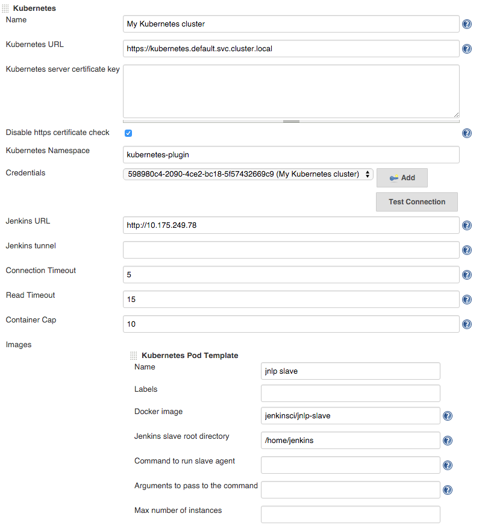

jenkins-kubernetes-plugin
=========================

Jenkins plugin to run dynamic slaves in a Kubernetes/Docker environment.

Based on the [Scaling Docker with Kubernetes](http://www.infoq.com/articles/scaling-docker-with-kubernetes) article,
automates the scaling of Jenkins slaves running in Kubernetes.

The plugin creates a Kubernetes Pod for each slave started,
defined by the Docker image to run, and stops it after each build.

Slaves are launched using JNLP, so it is expected that the image connects automatically to the Jenkins master.
For that some environment variables are automatically injected:

* `JENKINS_URL`: Jenkins web interface url
* `JENKINS_JNLP_URL`: url for the jnlp definition of the specific slave
* `JENKINS_SECRET`: the secret key for authentication

Tested with [`csanchez/jenkins-slave`](https://registry.hub.docker.com/u/csanchez/jenkins-slave/),
see the [Docker image source code](https://github.com/carlossg/jenkins-slave-docker).


# Configuration on Google Container Engine

Create a cluster 
```
    gcloud container clusters create jenkins --num-nodes 1 --machine-type g1-small
```
and note the admin password and server certitifate.

Or use Google Developer Console to create a Container Engine cluster, then run 
```
    gcloud container clusters get-credentials
    kubectl config view --raw
```
the last command will output kubernetes cluster configuration including API server URL, admin password and root certificate

# Debugging

To inspect the json messages sent back and forth to the Kubernetes API server you can configure
a new [Jenkins log recorder](https://wiki.jenkins-ci.org/display/JENKINS/Logging) for `org.apache.http`
at `DEBUG` level.


# Building

Run `mvn clean package` and copy `target/kubernetes.hpi` to Jenkins plugins folder.

# Docker image

Docker image for Jenkins, with plugin installed.
Based on the [official image](https://registry.hub.docker.com/_/jenkins/).

## Running

    docker run --rm --name jenkins -p 8080:8080 -p 50000:50000 -v /var/jenkins_home csanchez/jenkins-kubernetes

## Testing locally

A local testing cluster with one node can be created with Docker Compose

    docker-compose up

When using boot2docker or Docker Engine with a remote host, the remote Kubernetes API can be exposed
with `docker-machine ssh MACHINE_NAME -- -L 0.0.0.0:8080:localhost:8080` or `boot2docker ssh -L 0.0.0.0:8080:localhost:8080`

More info

* [Docker CookBook examples](https://github.com/how2dock/docbook/tree/master/ch05/docker)
* [Kubernetes Getting started with Docker](https://github.com/GoogleCloudPlatform/kubernetes/blob/master/docs/getting-started-guides/docker.md)

## Running in Kubernetes (Google Container Engine)

Assuming you created a Kubernetes cluster named `jenkins` this is how to run both Jenkins and slaves there.

Create a GCE disk named `kubernetes-jenkins` to store the data.

    gcloud compute disks create --size 20GB kubernetes-jenkins

Creating the pods and services

    kubectl create -f ./src/main/kubernetes/pod.yml
    kubectl create -f ./src/main/kubernetes/service.yml

Connect to the ip of the network load balancer created by Kubernetes, port 80.
Get the ip (in this case `104.197.19.100`) with `kubectl describe services/jenkins`
(it may take a bit to populate)

    $ kubectl describe services/jenkins
    Name:           jenkins
    Namespace:      default
    Labels:         <none>
    Selector:       name=jenkins
    Type:           LoadBalancer
    IP:         10.175.244.232
    LoadBalancer Ingress:   104.197.19.100
    Port:           http    80/TCP
    NodePort:       http    30080/TCP
    Endpoints:      10.172.1.5:8080
    Port:           slave   50000/TCP
    NodePort:       slave   32081/TCP
    Endpoints:      10.172.1.5:50000
    Session Affinity:   None
    No events.

Configure Jenkins, adding the `Kubernetes` cloud under configuration, setting
Kubernetes URL to the container engine cluster endpoint or simply `https://kubernetes.default.svc.cluster.local`.
Under credentials, click `Add` and select `Kubernetes Service Account`,
or alternatively use the Kubernetes API username and password.


You may want to set `Jenkins URL` to the internal service IP, `http://10.175.244.232` in this case,
to connect through the internal network.

Set `Container Cap` to a reasonable number for tests, i.e. 3.

Add an image with

* Docker image: `jenkinsci/jnlp-slave`
* Jenkins slave root directory: `/home/jenkins`



Now it is ready to be used.

Tearing it down

    kubectl delete pods/jenkins
    kubectl delete services/jenkins


## Building

    docker build -t csanchez/jenkins-kubernetes .
